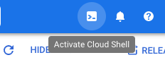
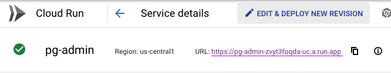
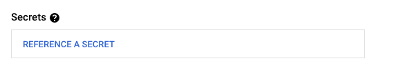
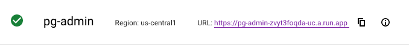
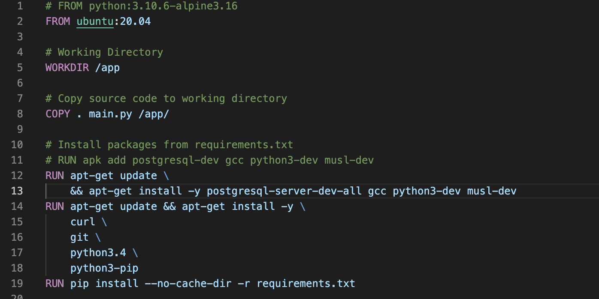
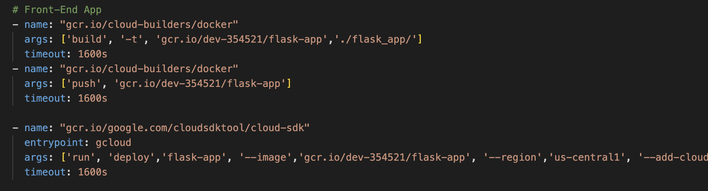
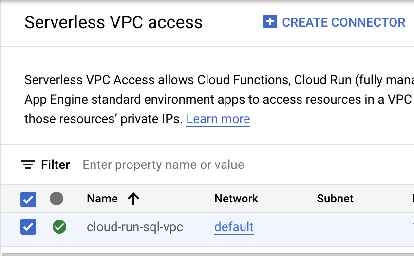
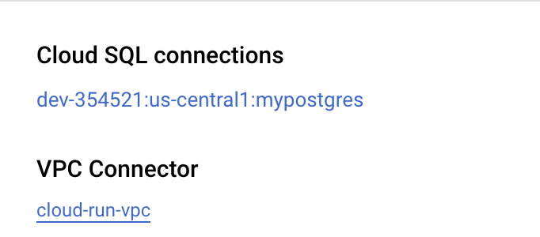

# Chicago Business Intelligence

## Microservice Architecture

This purpose of this project is to build a microservice in Golang to pull in data from various endpoints, clean the data, and insert the data into a postgres database hosted on GCP with Docker containers. The project source code is pushed to GitHub, after which a trigger is set off within GCP Cloud Build and pulls in the various images and builds the environments outlined within the cloudbuild.yaml file. A different way to set up the CI/CD pipeline is to utilize GitHub Actions, which can achieve the same thing, but not specific to GCP. From there, the services are run in GCP Cloud Run, which exposes endpoints for the various services that are created ("go-microservice" and "pg-admin").

## Set Up

### Postgres Database Setup

- Create a new project on the GCP console. Make a note of the project id and project name.

- Within your GCP console, click "Activate Cloud Shell" located at the top right of your console.

- Once the Cloud Shell terminal is launched, type the following command to set your project: "gcloud config set project {YOUR PROJECT ID}".

- Create the database instance of postgres using the following command: “gcloud sql instances create mypostgres --database-version=POSTGRES_14 --cpu=2 -- memory=7680MB --region=us-central”

- Create sql users on the database instance using the following command: “gcloud sql users set-password postgres --instance=mypostgres --password=root”

- Create a database for our microservice using the following command: “gcloud sql databases create chicago_business_intelligence --instance=mypostgres”

- Within the GCP consold, search for SQL and check to see if the database instance is up and running.

### CI/CD Pipeline Setup

- Create your repository on GitHub

- Within the GCP console, search for Cloud Build and enable it for your project if it isn't already.

- After the API in enabled, navigate to Cloud Build --> Triggers and create a new trigger.

- Fill in the required details for the trigger, and connect it to the GitHub repository you just created, then create the trigger. Based off of the default settings, the trigger will set off when new code is pushed to the main brance of the repository.

### Containers for Microservices Setup

- Enable the Cloud Run API for your project (similar to how the Cloud Build API was enabled).

- Go to the IAM & Admin --> IAM page and make sure all the required roled are enabled for the project. Make sure your cloudbuild.gserviceaccount.com principal has roles: "Cloud Build Service Account", "Cloud Run Service Agent", and "Owner".

### Secrets

- Instead of exposing passwords or API keys in the code, you can utilize secrets within GCP with GCP Secret Manager. Once you navigate to Secret Manager, click "Create Secret". You can either upload a file, or paste your keys into the box labeled "Secret value".

- Once the secret is created within Secret Manager, navigate to Cloud Run and click on the microservice environment where you want to use the secret, and click on "Edit & Deploy New Revision" at the top of the page.

- Under "Secrets", click on "Reference a Secret" and select the secret you want to use. Select a reference method, specify the version, and click "Done", then click "Deploy".

 
 
 

Once your microservices have been built and deployed, as seen in Cloud Run, click on the generated URL to access and run the microservices.

## Front End

Create a Dockerfile specifically for your front end application if you're using something different than Golang. In this example, Flask is being utilized and therefore a Docker image is needed to build a Python environment.

Within Google Cloud Shell, run this command: "gcloud artifacts repositories create [ADD NAME HERE] --repository-format=docker \ --location=us-central1 --description="Docker repository"

Add in steps to the existing cloudbuild.yaml file to pull in the image, build, and deploy your front-end application

Once the front-end instance is running on Cloud Run, you need to configure access between the front end server and the postgres server built above. Go to Serverless VPC access and create a connector. 

Then within the front-end Cloud Run instance configure the connection to the VPC connector.

